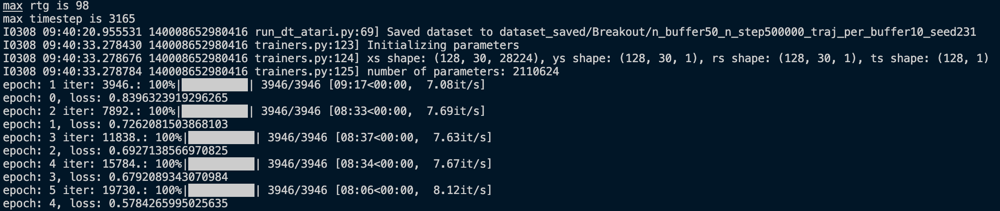

# Decision Transformer in JAX and Haiku

Reproduction of 'Decision Transformer: Reinforcement Learning via Sequence Modeling' in JAX and Haiku, based on the paper at <https://arxiv.org/abs/2106.01345>.

## Result

### Atari

~2x faster training speed, while achieving the evaluation performance comparable to the original implementation.

## Usage

### Setup

- The dependency management of this project is based on Conda + pip-tool.
- The name of the Conda environment can be specified in the `Makefile` by changing the `CONDA_ENV` (Default: decision-transformer-jax)
- To create an environment using GPU, run followinng command: `make gpu-env`or just `make` (Default: GPU)
- For CPU env, run: `make cpu-env`. _TPU is not supported yet._
- Activate the installed environment by running `conda activate research`(or the environment name you specified)
- Download and install Atari ROMs `wget http://www.atarimania.com/roms/Roms.rar && unrar e -r Roms.rar ./Roms/ && python -m atari_py.import_roms ./Roms/ && rm -rf Roms.rar ./Roms/`
- Enjoy!👋
- Whenever you want, **the requirements** of the project can be modified by editing files under `requirements` folder, then rerun the command(`make gpu-env` or `make cpu-env`). Thanks to pip-tools, the changes can be quickly applied to the environment.

Alternatively, you can set up the project using auto-generated `requirements-cpu.txt` or `requirement-gpu.txt`: e.g. `pip install -r requirements-gpu.txt` (tested in python=3.8, cudatoolkit=11.1, cudnn=8.2)

### Training

Run `cd dt_jax && bash run.sh` to train the model.

### Evaluating pre-trained model

### Testing

Run `python -m unittest discover -s dt_jax -p '*_test.py'`

## Author

Yun-hyeok Kwak(yunhyeok.kwak@gmail.com)

## Credits

- Lili Chen*, Kevin Lu*, et al. "Decision transformer: Reinforcement learning via sequence modeling." Neural Information Processing Systems (2021). [arXiv](https://arxiv.org/abs/2106.01345)
- [Original implementation](https://github.com/kzl/decision-transformer/), licensed under the MIT License
- [Karpathy's minGPT](https://github.com/karpathy/minGPT), licensed under the MIT license
- [mgrankin's minGPT](https://github.com/mgrankin/minGPT), licensed under the Apache License 2.0

## License

MIT License

Copyright (c) 2022 Yun-hyeok Kwak
